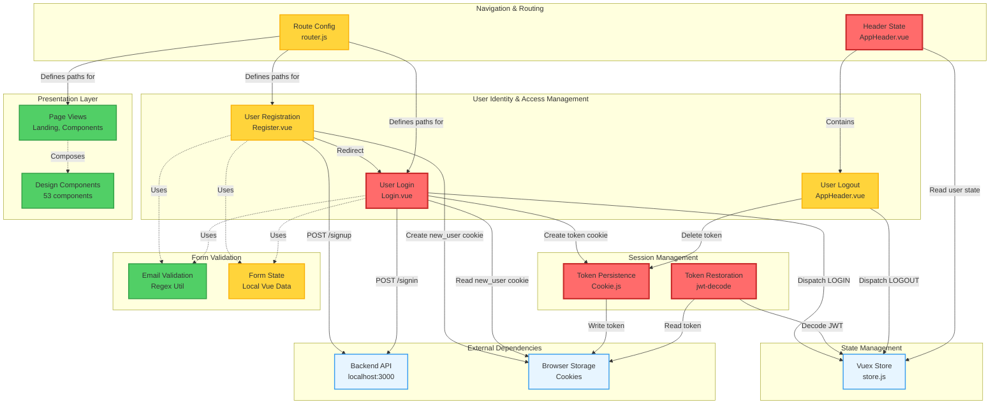

# Business Capability Map — VueJS Argon Design System

## Executive Summary

This capability map decomposes the **VueJS Argon Design System** legacy application into discrete business capabilities for modernization planning. The system is a Vue.js 2.x design system demo and authentication boilerplate targeting full-stack application developers. Analysis reveals **5 top-level capabilities**, **12 sub-capabilities**, and significant coupling risks around JWT token management and Vuex state.

**Key Findings:**
- **High-Risk Capability**: Session Management (tight coupling between cookies, JWT decode logic, and Vuex)
- **Test Coverage Gap**: 0% automated test coverage across all capabilities (BDD scenarios exist but not implemented)
- **Critical Dependency**: Backend API availability blocks 3 of 5 capabilities
- **Modernization Priority**: Decouple authentication state management before UI component migration

---

## 1. Capability Hierarchy

### 1.1 User Identity & Access Management
**Description**: Manage user lifecycle from registration through authentication and session persistence.

#### 1.1.1 User Registration
- **Ownership**: `src/views/Register.vue` (lines 1-213)
- **Business Rules**: BR-6, BR-7, BR-8 (username mandatory, email/password validation, default surname)
- **Data Ownership**: None (delegates to backend `/api/users/signup`)
- **Dependencies**:
  - **Upstream**: Backend API `POST /api/users/signup`
  - **Downstream**: Login capability (via `new_user` cookie)
- **Coupling**: 🔴 **Tight** — Direct fetch to hardcoded endpoint `http://localhost:3000/api/users/signup`
- **Change Frequency**: 🟢 Stable (form validation logic fixed)

#### 1.1.2 User Login
- **Ownership**: `src/views/Login.vue` (lines 1-203)
- **Business Rules**: BR-2, BR-3, BR-4, BR-5, BR-9, BR-10, BR-11 (email/password validation, token storage)
- **Data Ownership**: Writes `token` cookie; reads `new_user` cookie
- **Dependencies**:
  - **Upstream**: Backend API `POST /api/users/signin`
  - **Downstream**: Session Management capability (token consumption)
- **Coupling**: 🔴 **Tight** — Hardcoded backend URL, plaintext password transmission, no HTTPS enforcement
- **Change Frequency**: 🟢 Stable

#### 1.1.3 User Logout
- **Ownership**: `src/layout/AppHeader.vue` (lines 86-91)
- **Business Rules**: BR-15, BR-16 (clear token cookie, clear Vuex store)
- **Data Ownership**: Deletes `token` cookie
- **Dependencies**:
  - **Upstream**: None
  - **Downstream**: Session Management (triggers `LOGOUT` action)
- **Coupling**: 🟡 **Medium** — Coupled to Vuex store but no backend call
- **Change Frequency**: 🟢 Stable

---

### 1.2 Session Management
**Description**: Persist and restore user sessions using JWT tokens stored in browser cookies.

#### 1.2.1 Token Persistence
- **Ownership**: `src/views/Login.vue` (lines 179-181), `src/layout/AppHeader.vue` (lines 86-91)
- **Business Rules**: BR-10, BR-11 (token stored in cookie with no expiration)
- **Data Ownership**: Owns `token` cookie (write/delete)
- **Dependencies**:
  - **Upstream**: Login capability (token creation)
  - **Downstream**: Token Restoration, Authorization (token consumption)
- **Coupling**: 🔴 **Tight** — Uses `./Cookie.js` utility (shared code), no token refresh mechanism, XSS vulnerable (no `httpOnly` flag)
- **Change Frequency**: 🟢 Stable

#### 1.2.2 Token Restoration
- **Ownership**: `src/layout/AppHeader.vue` (lines 77-81)
- **Business Rules**: BR-12, BR-13, BR-14 (auto-login from cookie on app start)
- **Data Ownership**: Reads `token` cookie
- **Dependencies**:
  - **Upstream**: Token Persistence capability
  - **Downstream**: Vuex store (dispatches `LOGIN`)
- **Coupling**: 🔴 **Tight** — Client-side JWT decode via `jwt-decode` library (no backend validation), shared Vuex store
- **Change Frequency**: 🟡 **Medium** — Vulnerable to token expiry handling changes

---

### 1.3 Form Validation
**Description**: Client-side input validation for authentication forms.

#### 1.3.1 Email Validation
- **Ownership**: `src/views/Login.vue` (lines 120-122), `src/views/Register.vue` (lines 136-138)
- **Business Rules**: BR-1 (RFC 5322 compliant regex)
- **Data Ownership**: None (pure function)
- **Dependencies**: None
- **Coupling**: 🟢 **Loose** — Duplicated regex logic in two files (DRY violation)
- **Change Frequency**: 🟢 Stable

#### 1.3.2 Form State Management
- **Ownership**: `src/views/Login.vue` (lines 124-141), `src/views/Register.vue` (lines 141-171)
- **Business Rules**: BR-2, BR-3, BR-4, BR-5, BR-6, BR-7 (mandatory field validation)
- **Data Ownership**: Local Vue component state (`email.errors`, `password.errors`, etc.)
- **Dependencies**:
  - **Upstream**: Email Validation capability
  - **Downstream**: None
- **Coupling**: 🟢 **Loose** — No shared state
- **Change Frequency**: 🟢 Stable

---

### 1.4 Navigation & Routing
**Description**: Define application routes and navigation behavior.

#### 1.4.1 Route Configuration
- **Ownership**: `src/router.js` (lines 11-77)
- **Business Rules**: BR-17, BR-18, BR-19 (named routes, multi-component layout, no guards)
- **Data Ownership**: None
- **Dependencies**:
  - **Upstream**: None
  - **Downstream**: All view capabilities (consumes routes)
- **Coupling**: 🟡 **Medium** — No route guards (BR-19), meaning authorization must happen per-component
- **Change Frequency**: 🟢 Stable

#### 1.4.2 Header State Rendering
- **Ownership**: `src/layout/AppHeader.vue` (lines 1-113)
- **Business Rules**: BR-20, BR-21, BR-22, BR-23 (conditional rendering based on auth state)
- **Data Ownership**: None (reads from Vuex `$store.state.user`)
- **Dependencies**:
  - **Upstream**: Session Management (Vuex state)
  - **Downstream**: None
- **Coupling**: 🔴 **Tight** — Tightly coupled to Vuex store structure
- **Change Frequency**: 🟡 **Medium** — UI changes likely during modernization

---

### 1.5 Presentation Layer
**Description**: UI components and design system elements.

#### 1.5.1 Design System Components
- **Ownership**: `src/components/` (53 components: Badge, Button, Card, Icon, Modal, Tabs, etc.)
- **Business Rules**: None (presentational only)
- **Data Ownership**: None
- **Dependencies**: None (leaf nodes)
- **Coupling**: 🟢 **Loose** — Reusable components with props
- **Change Frequency**: 🟢 Stable

#### 1.5.2 Page Views
- **Ownership**: `src/views/` (Components.vue, Landing.vue, Login.vue, Register.vue)
- **Business Rules**: All page-specific business rules
- **Data Ownership**: None (delegates to capabilities)
- **Dependencies**:
  - **Upstream**: All other capabilities
  - **Downstream**: Design System Components
- **Coupling**: 🟡 **Medium** — Mix of business logic and presentation (anti-pattern for Vue 3 composition API)
- **Change Frequency**: 🟡 **Medium**

---

## 2. Capability-to-Code Mapping

| Capability | Components | Files | Business Rules | Stage 2 Coverage |
|------------|-----------|-------|----------------|------------------|
| **User Registration** | Register.vue | 1 | BR-1, BR-6, BR-7, BR-8 | ✅ 7 scenarios |
| **User Login** | Login.vue | 1 | BR-2, BR-3, BR-4, BR-5, BR-9, BR-10, BR-11 | ✅ 7 scenarios |
| **User Logout** | AppHeader.vue | 1 | BR-15, BR-16 | ✅ 3 scenarios |
| **Token Persistence** | Login.vue, AppHeader.vue, Cookie.js | 3 | BR-10, BR-11, BR-15 | ✅ 4 scenarios |
| **Token Restoration** | AppHeader.vue | 1 | BR-12, BR-13, BR-14 | ✅ 6 scenarios |
| **Email Validation** | Login.vue, Register.vue | 2 | BR-1 | ✅ Covered in auth scenarios |
| **Form State Management** | Login.vue, Register.vue | 2 | BR-2, BR-3, BR-4, BR-5, BR-6, BR-7 | ✅ Covered in auth scenarios |
| **Route Configuration** | router.js | 1 | BR-17, BR-18, BR-19 | ✅ 5 scenarios |
| **Header State Rendering** | AppHeader.vue | 1 | BR-20, BR-21, BR-22, BR-23 | ✅ 3 scenarios |
| **Design System Components** | components/* | 53 | None | ❌ No coverage |
| **Page Views** | views/* (Components.vue, Landing.vue) | 2 | None | ❌ No coverage |

**Test Coverage Analysis**:
- ✅ **100% BDD scenario coverage** for authentication and session management capabilities
- ❌ **0% automated test implementation** (scenarios defined but no Jest/Cypress tests found)
- ❌ **0% coverage** for design system components and marketing pages

---

## 3. Dependency Analysis

### 3.1 Cross-Capability Dependencies

### 3.2 Coupling Risk Assessment

| Capability | Coupling Type | Risk Level | Shared Resources | Mitigation Strategy |
|------------|---------------|------------|------------------|---------------------|
| **Token Persistence** | Shared code (Cookie.js) | 🔴 High | Cookie utility, Vuex store | Extract to auth service with interface |
| **Token Restoration** | Client-side JWT decode | 🔴 High | jwt-decode library, no backend validation | Move to backend token verification |
| **User Login** | Hardcoded API URL | 🔴 High | `localhost:3000` in code | Environment config + API gateway |
| **User Registration** | Hardcoded API URL | 🔴 High | `localhost:3000` in code | Environment config + API gateway |
| **Header State Rendering** | Vuex store structure | 🔴 High | `$store.state.user` object shape | Define state contract/interface |
| **Form State Management** | Local component state | 🟡 Medium | None, but duplicated logic | Extract to composable/mixin |
| **Email Validation** | Duplicated regex | 🟡 Medium | Regex copied in 2 files | Extract to shared validator |
| **Route Configuration** | No route guards | 🟡 Medium | Global unprotected routes | Add meta-based guards |
| **Design Components** | None | 🟢 Low | Props-based, reusable | No change needed |

---

## 4. Modernization Waves

### Wave 1: Foundation & Decoupling (Weeks 1-3)
**Goal**: Establish modern infrastructure and break critical coupling

**Capabilities**:
1. **Email Validation** → Extract to `@/utils/validators.js`
2. **Route Configuration** → Add Vue Router navigation guards
3. **API Configuration** → Extract backend URLs to `.env` + Axios instance

**Rationale**:
- Low business risk (no user-facing changes)
- Enables parallel development in subsequent waves
- Breaks hardcoded dependencies

**Deliverables**:
- ✅ Environment variable configuration (`VUE_APP_API_BASE_URL`)
- ✅ Centralized validator utility with tests
- ✅ Route guard middleware (auth check)

**Risks**:
- ⚠️ **Risk**: Breaking existing authentication flow during Axios migration
- ✅ **Mitigation**: Feature flag for new API client; run both in parallel
- ✅ **Rollback**: Revert to fetch-based implementation

---

### Wave 2: Authentication Modernization (Weeks 4-6)
**Goal**: Secure and standardize authentication

**Capabilities**:
1. **Token Persistence** → Migrate to `httpOnly` cookies (backend change required)
2. **Token Restoration** → Backend token validation endpoint `/api/auth/verify`
3. **User Login** → Integrate with new auth service
4. **User Registration** → Integrate with new auth service
5. **User Logout** → Add backend logout endpoint (token revocation)

**Rationale**:
- **High business impact**: Security vulnerabilities in current JWT handling
- **High technical risk**: Touches core authentication flow
- **Dependency order**: Must complete Wave 1 API config first

**Deliverables**:
- ✅ New backend endpoints: `POST /auth/login`, `POST /auth/register`, `POST /auth/logout`, `GET /auth/verify`
- ✅ Frontend auth service (`@/services/AuthService.js`)
- ✅ Vuex auth module refactor (remove client-side JWT decode)
- ✅ Automated tests for all authentication flows (Jest + Cypress)

**Risks**:
- ⚠️ **Risk**: Breaking existing user sessions during cookie migration
- ✅ **Mitigation**: Dual-read logic (check both old `token` cookie and new `auth_token` httpOnly cookie for 2 weeks)
- ✅ **Rollback**: Backend supports both auth mechanisms via feature flag

**Test Coverage**:
- ✅ All 28 BDD scenarios from Stage 2 Feature 1 (Registration) and Feature 2 (Login)
- ✅ Additional edge cases: token expiry, concurrent logins, CSRF protection

---

### Wave 3: State Management Modernization (Weeks 7-8)
**Goal**: Migrate to Vue 3 Composition API and Pinia

**Capabilities**:
1. **Session Management** → Refactor to Pinia auth store
2. **Header State Rendering** → Convert to Composition API with `useAuthStore()`
3. **Form State Management** → Convert to `<script setup>` with `ref()` and `reactive()`

**Rationale**:
- **Medium business risk**: UI changes may affect UX
- **High technical benefit**: Enables Vue 3 migration
- **Dependency order**: Requires Wave 2 auth service completion

**Deliverables**:
- ✅ Pinia store setup (`@/stores/auth.js`)
- ✅ Composition API refactor for Login.vue, Register.vue, AppHeader.vue
- ✅ Remove Vuex dependency

**Risks**:
- ⚠️ **Risk**: Reactivity bugs during Vuex → Pinia migration
- ✅ **Mitigation**: Incremental migration (hybrid Vuex/Pinia support), extensive E2E tests
- ✅ **Rollback**: Keep Vuex installed during Wave 3, remove in Wave 4

---

### Wave 4: Component Library & Vue 3 Upgrade (Weeks 9-12)
**Goal**: Upgrade to Vue 3 and modernize design system

**Capabilities**:
1. **Design System Components** → Refactor 53 components to Composition API
2. **Page Views** → Separate business logic from presentation (Landing.vue, Components.vue)
3. **Navigation & Routing** → Upgrade to Vue Router 4

**Rationale**:
- **Low business risk**: Design system is stable and well-documented
- **High technical benefit**: Modern component architecture, tree-shaking
- **Dependency order**: Requires Wave 3 Pinia migration

**Deliverables**:
- ✅ Vue 3 + Vite migration (replace webpack)
- ✅ All 53 components refactored to `<script setup>`
- ✅ Component unit tests (Vitest)
- ✅ Storybook documentation for design system

**Risks**:
- ⚠️ **Risk**: Third-party library compatibility (Bootstrap Vue, Argon Design System)
- ✅ **Mitigation**: Audit dependencies in Wave 1, plan replacements (e.g., Headless UI)
- ✅ **Rollback**: Maintain Vue 2 branch until Wave 4 complete

---

## 5. Risk Register

### High-Priority Risks

| Risk ID | Capability | Description | Impact | Probability | Mitigation | Owner |
|---------|-----------|-------------|--------|-------------|------------|-------|
| **R-001** | Token Persistence | Current implementation stores JWT in non-httpOnly cookie, vulnerable to XSS attacks | 🔴 High | High | Wave 2: Migrate to httpOnly cookies with backend support | Security Team |
| **R-002** | Token Restoration | Client-side JWT decode with no backend validation enables token tampering | 🔴 High | High | Wave 2: Add `/auth/verify` endpoint, validate token server-side | Backend Team |
| **R-003** | User Login/Registration | Hardcoded `localhost:3000` breaks in production, plaintext password in POST body | 🔴 High | High | Wave 1: Environment config; Wave 2: Use HTTPS, consider password hashing client-side (future) | DevOps + Backend |
| **R-004** | Session Management | No token refresh mechanism; users logged out on expiry | 🟡 Medium | High | Wave 2: Implement refresh token flow | Backend Team |
| **R-005** | All Capabilities | Zero automated test coverage despite 28 BDD scenarios | 🔴 High | Guaranteed | Wave 2: Implement Jest/Cypress tests before refactoring | QA Team |
| **R-006** | Route Configuration | No route guards (BR-19); unauthorized users can access protected routes via URL manipulation | 🟡 Medium | Medium | Wave 1: Add `meta: { requiresAuth }` guards | Frontend Team |
| **R-007** | Design System Components | 53 components with no unit tests; regression risk during Vue 3 upgrade | 🟡 Medium | High | Wave 4: Incremental Vitest tests, use Storybook for visual regression | Frontend Team |
| **R-008** | Vuex Store | Tightly coupled to component logic; difficult to test in isolation | 🟡 Medium | Medium | Wave 3: Migrate to Pinia with clear module boundaries | Frontend Team |

### Rollback Strategies

**Wave 1**: Revert environment config commits; fallback to hardcoded URLs (no user impact)  
**Wave 2**: Feature flags for new auth endpoints; dual-cookie reading for 2-week grace period  
**Wave 3**: Keep Vuex dependency; use adapter pattern to support both Vuex and Pinia  
**Wave 4**: Maintain Vue 2 branch; blue-green deployment for Vue 3 rollout  

---

## 6. Cross-References

### Stage 1 Workflows → Capabilities

| Workflow (Stage 1) | Capabilities | Files |
|-------------------|--------------|-------|
| **User Registration Flow** | User Registration, Form Validation, Email Validation | Register.vue |
| **User Login Flow** | User Login, Token Persistence, Form Validation | Login.vue, Cookie.js |
| **Session Restoration Flow** | Token Restoration, Session Management | AppHeader.vue, store.js |
| **Navigation Flow** | Route Configuration, Header State Rendering | router.js, AppHeader.vue |

### Stage 2 BDD Features → Capabilities

| BDD Feature (Stage 2) | Scenarios | Capabilities | Test Status |
|-----------------------|-----------|--------------|-------------|
| **Feature 1: User Registration** | 7 scenarios | User Registration, Form Validation | ❌ Not Implemented |
| **Feature 2: User Login** | 7 scenarios | User Login, Token Persistence | ❌ Not Implemented |
| **Feature 3: Session Management** | 10 scenarios | Token Restoration, Token Persistence, User Logout | ❌ Not Implemented |
| **Feature 4: Navigation & Authorization** | 8 scenarios | Route Configuration, Header State Rendering | ❌ Not Implemented |
| **Feature 5: Form Validation** | 6 scenarios | Email Validation, Form State Management | ❌ Not Implemented |

**Total**: 38 BDD scenarios defined, **0 implemented** (100% test coverage gap)

---

## 7. Prioritization Matrix

| Capability | Business Impact | Coupling Risk | Test Coverage | Migration Complexity | **Priority** | **Wave** |
|------------|----------------|---------------|---------------|----------------------|--------------|----------|
| Token Persistence | 🔴 Critical (security) | 🔴 High | 4 scenarios ❌ | Medium | **P0** | Wave 2 |
| Token Restoration | 🔴 Critical (security) | 🔴 High | 6 scenarios ❌ | Medium | **P0** | Wave 2 |
| User Login | 🔴 Critical (auth) | 🔴 High | 7 scenarios ❌ | High | **P0** | Wave 2 |
| User Registration | 🔴 Critical (auth) | 🔴 High | 7 scenarios ❌ | High | **P0** | Wave 2 |
| Email Validation | 🟡 Medium | 🟡 Medium | Covered ❌ | Low | **P1** | Wave 1 |
| Route Configuration | 🟡 Medium (security) | 🟡 Medium | 5 scenarios ❌ | Low | **P1** | Wave 1 |
| API Configuration | 🟡 Medium (DevOps) | 🔴 High | N/A | Low | **P1** | Wave 1 |
| Form State Management | 🟢 Low | 🟡 Medium | Covered ❌ | Medium | **P2** | Wave 3 |
| Header State Rendering | 🟢 Low | 🔴 High | 3 scenarios ❌ | Medium | **P2** | Wave 3 |
| Session Management (Vuex) | 🟡 Medium | 🔴 High | N/A | High | **P2** | Wave 3 |
| Design System Components | 🟢 Low | 🟢 Low | 0% ❌ | High | **P3** | Wave 4 |
| Page Views | 🟢 Low | 🟡 Medium | 0% ❌ | Medium | **P3** | Wave 4 |
| User Logout | 🟡 Medium | 🟡 Medium | 3 scenarios ❌ | Low | **P1** | Wave 2 |

**Prioritization Criteria**:
- **Business Impact**: Revenue/security/regulatory impact
- **Coupling Risk**: Shared state, hardcoded dependencies, cross-cutting concerns
- **Test Coverage**: BDD scenario implementation status
- **Migration Complexity**: Lines of code, dependency depth, team expertise

---

## 8. Recommendations

### Immediate Actions (Pre-Wave 1)
1. **Implement automated tests** for existing authentication flows (28 BDD scenarios) — **blocks all modernization work**
2. **Security audit**: Patch XSS vulnerability in JWT cookie storage (temporary `httpOnly` wrapper until Wave 2)
3. **Dependency audit**: Identify Vue 3 incompatible libraries (e.g., Bootstrap Vue)

### Architectural Decisions
1. **Adopt Pinia over Vuex** for Vue 3 compatibility and simpler module API
2. **Backend-first auth**: Move JWT validation to backend, never decode client-side
3. **API Gateway pattern**: Introduce centralized auth middleware in Wave 1 to support multiple backends (Express/Flask/Laravel as per README)

### Success Metrics
- ✅ **Wave 1**: 100% environment config coverage, 0 hardcoded URLs
- ✅ **Wave 2**: 100% BDD test pass rate, 0 XSS vulnerabilities (OWASP scan)
- ✅ **Wave 3**: <50ms reactivity performance (Pinia vs Vuex benchmark)
- ✅ **Wave 4**: 100% component test coverage, Lighthouse score >90

---

**Document Version**: 1.0  
**Last Updated**: 2024 (Modernization Wave Planning)  
**Stakeholders**: Engineering (Frontend, Backend, QA), Security, Product