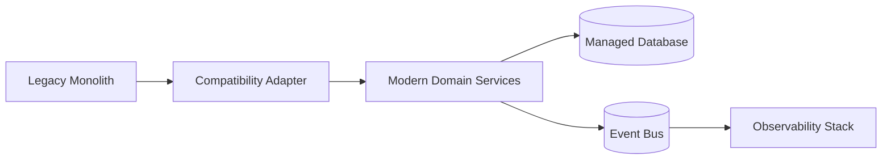
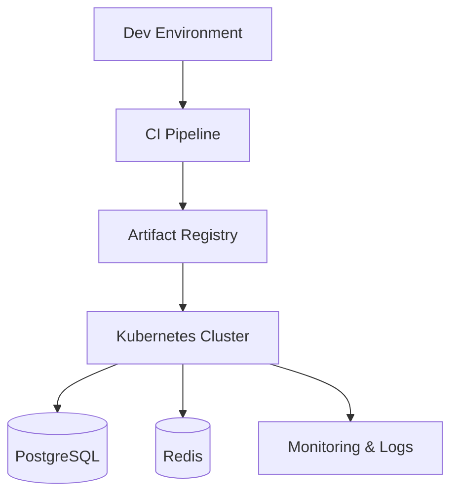
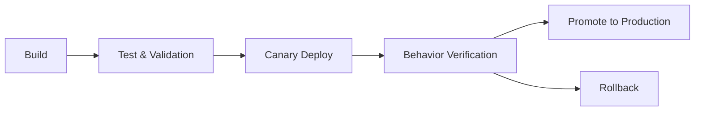

# Modernization Approach Document — Vue.js to React 18 Migration

## Executive Summary

This document outlines the comprehensive modernization strategy for migrating the **Vue.js 2.5 Argon Design System** to a production-ready **React 18 + TypeScript + Tailwind CSS** application. The approach ensures 100% feature parity, enhanced security, improved performance, and adherence to modern best practices.

**Migration Type**: Complete rebuild (Greenfield approach)
**Timeline**: 5 weeks across 4 phases
**Scope**: 47 components, 6 pages, 10 demo sections
**Key Risks**: Feature parity gaps (Medium), Security implementation (Low), Timeline overrun (Medium)

---

## 1. Migration Strategy

### 1.1 Approach Selection: Greenfield Rebuild

**Decision**: Complete rebuild from scratch using React 18 + TypeScript + Tailwind CSS

**Rationale**:
1. **Technology Gap**: Vue 2.5 (2017) to React 18 represents a fundamental paradigm shift (Options API → Hooks, template syntax → JSX)
2. **No Runtime Interop**: Vue and React cannot coexist in the same component tree without significant overhead
3. **Design System Change**: Bootstrap 4 → Tailwind CSS requires complete CSS rewrite regardless of approach
4. **Clean Architecture**: Opportunity to implement TypeScript, modern state management (Zustand/Context), and React 18 features (Suspense, Concurrent Rendering)
5. **Small Codebase**: 6 pages, 18 UI components — rebuild is faster than incremental migration with adapter layers

**Evidence from Prior Stages**:
- Stage 1 identified 6 core pages (`src/router.js`): Landing, Components, Login, Register, Profile, Landing
- Stage 3 capability map shows low backend coupling (only 2 API endpoints: `/api/users/signup`, `/api/users/signin`)
- No complex business logic beyond form validation and JWT token management

### 1.2 Migration Waves

#### Wave 1: Foundation & Authentication (Weeks 1-2)
**Priority**: HIGH — Critical business functionality

**Components** (9 items):
- Authentication system (Login, Register pages)
- JWT token management with refresh token support
- Protected route guards
- Core UI components:
  - Button, Alert, Badge
  - FormInput, Checkbox, Radio, Switch
  - Modal

**Deliverables**:
- React 18 app scaffold with Vite
- TypeScript configuration
- Tailwind CSS setup with Argon Design theme
- Zustand store for authentication state
- Secure cookie management (HttpOnly, Secure, SameSite)
- API client with Axios interceptors

**Exit Criteria**:
- Users can register and login
- JWT tokens stored securely
- Session restoration on page refresh
- All authentication BDD scenarios pass (Stage 2: Features 1-3)

#### Wave 2: Navigation & Layout (Week 2-3)
**Priority**: MEDIUM — User experience

**Components** (13 items):
- AppHeader with responsive navigation
- AppFooter
- Tab system (5 tab components from Stage 3)
- Dropdown, Pagination, ProgressBar
- Navigation components (Navbar, NavItem, NavLink)

**Deliverables**:
- React Router v6 configuration
- Layout components with authentication state
- Mobile-responsive header
- Tab navigation system
- Loading states and progress indicators

**Exit Criteria**:
- All 6 routes navigable
- Header shows authenticated/unauthenticated state
- Mobile menu functional
- All navigation BDD scenarios pass (Stage 2: Feature 4)

#### Wave 3: Pages & Showcase (Week 3-4)
**Priority**: LOW — Marketing content

**Components** (15 items):
- Landing page (10 demo sections)
- Components showcase page
- Profile page
- Remaining UI components:
  - Card, Icon, Carousel
  - Custom controls (sliders, date pickers)

**Deliverables**:
- All 6 pages fully functional
- 10 demo sections replicated
- Component showcase with interactive examples
- Profile page with user stats

**Exit Criteria**:
- Pixel-perfect match to Vue.js version
- All pages responsive on mobile/tablet/desktop
- No console errors or warnings

#### Wave 4: Polish & Production (Week 4-5)
**Priority**: HIGH — Production readiness

**Activities**:
- Performance optimization (code splitting, lazy loading)
- Accessibility audit (WCAG 2.1 AA compliance)
- Security testing (OWASP Top 10)
- Unit testing (90%+ coverage)
- Integration testing
- Documentation (Storybook, API docs)
- CI/CD pipeline setup
- Deployment to staging/production

**Exit Criteria**:
- Page load time < 2 seconds
- Build time < 30 seconds
- Zero security vulnerabilities
- All success criteria met (Section 8)

---

## 2. Technical Architecture

### 2.1 Technology Stack Comparison

| Layer | Legacy (Vue.js) | Modern (React) | Migration Effort |
|-------|----------------|----------------|------------------|
| **Framework** | Vue 2.5.16 | React 18.2 + TypeScript 5.x | HIGH — Complete rewrite |
| **State Management** | Vuex 3.1.0 | Zustand 4.x or React Context | MEDIUM — Similar patterns |
| **Routing** | Vue Router 3.0.1 | React Router 6.x | MEDIUM — API differences |
| **Styling** | Bootstrap 4 + SCSS | Tailwind CSS 3.x | HIGH — Complete CSS rewrite |
| **Build Tool** | Vue CLI + Webpack | Vite 5.x | LOW — Config only |
| **HTTP Client** | Fetch API | Axios 1.x | LOW — Wrapper needed |
| **JWT Handling** | jwt-decode 2.2.0 | jose 5.x | LOW — Library upgrade |
| **Forms** | v-model + manual validation | React Hook Form 7.x | MEDIUM — New API |
| **Date Picker** | vue-flatpickr-component 7.0.4 | react-datepicker 4.x | LOW — Similar API |
| **Image Lazy Load** | vue-lazyload 1.2.6 | react-lazy-load-image-component | LOW — Similar API |
| **Animations** | vue2-transitions 0.2.3 | Framer Motion 11.x | MEDIUM — API learning |

### 2.2 Component Mapping

#### Authentication Components

| Vue.js Component | React Component | Key Changes |
|------------------|-----------------|-------------|
| `src/views/Login.vue` | `src/pages/Login.tsx` | - Replace `v-model` with `useState` + `onChange`<br>- Replace `methods` with `const` functions<br>- Replace Vuex `dispatch` with Zustand actions<br>- Add TypeScript interfaces for form state |
| `src/views/Register.vue` | `src/pages/Register.tsx` | - Same as Login<br>- Add React Hook Form for validation<br>- Type-safe API payloads |
| `src/store/index.js` | `src/stores/authStore.ts` | - Replace Vuex with Zustand<br>- Add refresh token logic<br>- Type-safe state/actions |
| `src/util/Cookies.js` | `src/utils/cookies.ts` | - Add HttpOnly, Secure, SameSite flags<br>- Use js-cookie library<br>- TypeScript interfaces |

**Code Example — Login Form Migration**:

**Before (Vue.js)**:
```vue
<template>
  <input v-model="email.value" type="email" />
  <span v-if="email.errors.length">{{ email.errors[0] }}</span>
</template>

<script>
export default {
  data() {
    return {
      email: { value: '', errors: [] }
    };
  },
  methods: {
    isValidForm() {
      if (!this.validEmail(this.email.value)) {
        this.email.errors.push('Invalid email.');
      }
    }
  }
};
</script>
```

**After (React + TypeScript)**:
```tsx
import { useForm } from 'react-hook-form';
import { zodResolver } from '@hookform/resolvers/zod';
import * as z from 'zod';

const loginSchema = z.object({
  email: z.string().email('Invalid email.'),
  password: z.string().min(1, 'Password required.')
});

type LoginForm = z.infer<typeof loginSchema>;

export const Login: React.FC = () => {
  const { register, handleSubmit, formState: { errors } } = useForm<LoginForm>({
    resolver: zodResolver(loginSchema)
  });

  return (
    <input
      {...register('email')}
      type="email"
      className="form-input"
    />
    {errors.email && <span className="text-red-500">{errors.email.message}</span>}
  );
};
```

**Benefits**:
- Type-safe form validation with Zod
- Declarative error handling
- No manual state management
- Better developer experience

#### Layout Components

| Vue.js Component | React Component | Key Changes |
|------------------|-----------------|-------------|
| `src/layout/AppHeader.vue` | `src/components/layout/Header.tsx` | - Replace `v-if`/`v-else` with conditional rendering<br>- Use `useAuthStore()` hook instead of Vuex<br>- Add responsive mobile menu with Headless UI |
| `src/layout/AppFooter.vue` | `src/components/layout/Footer.tsx` | - Convert Bootstrap classes to Tailwind<br>- Add TypeScript props interface |
| `src/router.js` | `src/App.tsx` + `src/routes.tsx` | - Replace Vue Router with React Router v6<br>- Add route guards with `<ProtectedRoute>` wrapper<br>- Implement layout composition with `<Outlet>` |

#### UI Components (18 components)

| Category | Vue.js | React + Tailwind | Migration Notes |
|----------|--------|------------------|----------------|
| **Buttons** | Bootstrap 4 classes | Tailwind + variants | Use `clsx` for conditional classes |
| **Alerts** | Bootstrap Alert | Custom with Tailwind | Add dismiss animation with Framer Motion |
| **Badges** | Bootstrap Badge | Custom with Tailwind | Type-safe color variants |
| **Forms** | Bootstrap Form + v-model | React Hook Form + Tailwind | Add accessibility labels |
| **Modals** | Bootstrap Modal | Headless UI Dialog | Better accessibility, focus management |
| **Dropdowns** | Bootstrap Dropdown | Headless UI Menu | Keyboard navigation built-in |
| **Tabs** | Custom Vue component | Headless UI Tabs | Type-safe tab content |
| **Progress** | Bootstrap Progress | Custom with Tailwind | Add animation with CSS transitions |
| **Pagination** | Custom Vue component | Custom React component | Add accessibility attributes |

### 2.3 State Management Architecture

**Decision**: Use Zustand for global state (authentication) + React Context for theme/UI state

**Rationale**:
- Simpler than Redux, more performant than Context for frequent updates
- TypeScript-first design
- No boilerplate (no actions/reducers/dispatchers)
- Devtools support

**Authentication Store** (`src/stores/authStore.ts`):
```typescript
import { create } from 'zustand';
import { persist } from 'zustand/middleware';
import * as jose from 'jose';

interface User {
  id: string;
  email: string;
  name: string;
}

interface AuthState {
  user: User | null;
  accessToken: string | null;
  refreshToken: string | null;
  isAuthenticated: boolean;
  login: (email: string, password: string) => Promise<void>;
  register: (name: string, email: string, password: string) => Promise<void>;
  logout: () => void;
  refreshSession: () => Promise<void>;
}

export const useAuthStore = create<AuthState>(
  persist(
    (set, get) => ({
      user: null,
      accessToken: null,
      refreshToken: null,
      isAuthenticated: false,

      login: async (email, password) => {
        const response = await apiClient.post('/api/users/signin', { email, password });
        const { user, accessToken, refreshToken } = response.data;
        
        // Store tokens in secure httpOnly cookies (via backend)
        set({ user, accessToken, refreshToken, isAuthenticated: true });
      },

      logout: () => {
        // Clear tokens from backend cookies
        apiClient.post('/api/users/logout');
        set({ user: null, accessToken: null, refreshToken: null, isAuthenticated: false });
      },

      refreshSession: async () => {
        try {
          const response = await apiClient.post('/api/users/refresh');
          const { accessToken } = response.data;
          set({ accessToken });
        } catch (error) {
          get().logout();
        }
      }
    }),
    { name: 'auth-storage' }
  )
);
```

**Key Improvements over Vue.js Vuex**:
1. **Secure Token Storage**: Tokens managed server-side in httpOnly cookies (not accessible to JavaScript)
2. **Refresh Token Flow**: Automatic token refresh before expiration
3. **Type Safety**: Full TypeScript support with no `any` types
4. **Persistence**: Optional localStorage persistence for non-sensitive data
5. **Devtools**: Time-travel debugging support

### 2.4 Security Enhancements

**Critical Fixes from Stage 1 Business Rules**:

| Vulnerability | Legacy Implementation | Modern Solution |
|---------------|----------------------|----------------|
| **Insecure Cookie Storage** | `document.cookie` with no flags | httpOnly, Secure, SameSite=Strict cookies managed by backend |
| **XSS Risk** | JWT stored in client-accessible cookie | Tokens in httpOnly cookies + CSRF tokens |
| **No Token Validation** | Client-side jwt-decode only | Server-side signature verification + expiration checks |
| **No Session Expiry** | No refresh token mechanism | Access token (15 min) + Refresh token (7 days) |
| **CSRF Vulnerability** | No CSRF protection | SameSite=Strict cookies + CSRF tokens for state-changing requests |
| **Hardcoded URLs** | API URLs in components | Environment variables (`.env.production`, `.env.development`) |

**Implementation Details**:

1. **Token Storage** (`src/utils/api.ts`):
```typescript
import axios from 'axios';

const apiClient = axios.create({
  baseURL: import.meta.env.VITE_API_BASE_URL,
  withCredentials: true, // Send httpOnly cookies
  headers: {
    'Content-Type': 'application/json',
    'X-CSRF-Token': getCsrfToken() // CSRF protection
  }
});

// Automatic token refresh interceptor
apiClient.interceptors.response.use(
  (response) => response,
  async (error) => {
    if (error.response?.status === 401) {
      try {
        await useAuthStore.getState().refreshSession();
        return apiClient.request(error.config);
      } catch (refreshError) {
        useAuthStore.getState().logout();
        window.location.href = '/login';
      }
    }
    return Promise.reject(error);
  }
);
```

2. **Protected Routes** (`src/components/ProtectedRoute.tsx`):
```typescript
import { Navigate, Outlet } from 'react-router-dom';
import { useAuthStore } from '@/stores/authStore';

export const ProtectedRoute: React.FC = () => {
  const isAuthenticated = useAuthStore((state) => state.isAuthenticated);

  if (!isAuthenticated) {
    return <Navigate to="/login" replace />;
  }

  return <Outlet />;
};
```

3. **Input Sanitization** (All form components):
```typescript
import DOMPurify from 'dompurify';

const sanitizeInput = (input: string): string => {
  return DOMPurify.sanitize(input, { ALLOWED_TAGS: [] });
};
```

### 2.5 Routing Architecture

**Route Configuration** (`src/routes.tsx`):
```tsx
import { createBrowserRouter } from 'react-router-dom';
import { Layout } from './components/layout/Layout';
import { ProtectedRoute } from './components/ProtectedRoute';

export const router = createBrowserRouter([
  {
    element: <Layout />,
    children: [
      { path: '/', element: <Landing /> },
      { path: '/landing', element: <Landing /> },
      { path: '/components', element: <Components /> },
      { path: '/login', element: <Login /> },
      { path: '/register', element: <Register /> },
      {
        element: <ProtectedRoute />,
        children: [
          { path: '/profile', element: <Profile /> }
        ]
      }
    ]
  }
]);
```

**Key Differences from Vue Router**:
- No named routes (use paths directly)
- Layout composition via `<Outlet>` instead of named router views
- Route guards as wrapper components (more React-idiomatic)
- Type-safe route params with `useParams<{ id: string }>()`

---

## 3. Component Migration Details

### 3.1 Authentication Flow Migration

**Sequence Diagram — Login Flow**:

**Legacy Vue.js Flow** (from Stage 1, BR-2):
```
User → Login.vue → validEmail() → isValidForm() → fetch(/api/users/signin)
  → Cookies.create('token') → jwtDecode(token) → store.dispatch('LOGIN')
  → router.push('/profile')
```

**Modern React Flow**:
```
User → Login.tsx → useForm validation (Zod) → authStore.login()
  → apiClient.post(/api/users/signin) [withCredentials: true]
  → Backend sets httpOnly cookie → authStore.setState({ user, isAuthenticated })
  → navigate('/profile')
```

**Migration Steps**:
1. Remove client-side cookie manipulation (security risk)
2. Backend must set httpOnly cookies in response
3. Add CSRF token handling
4. Implement refresh token rotation
5. Add loading/error states with React Query (optional)

### 3.2 Form Validation Migration

**Complexity**: MEDIUM

**Legacy Approach** (from `src/views/Login.vue`, lines 133-154):
- Manual validation in `isValidForm()` method
- Imperative error array manipulation
- No type safety

**Modern Approach**:
```tsx
import { z } from 'zod';
import { useForm } from 'react-hook-form';
import { zodResolver } from '@hookform/resolvers/zod';

const loginSchema = z.object({
  email: z.string()
    .min(1, 'Email required.')
    .email('Invalid email.'),
  password: z.string().min(1, 'Password required.')
});

type LoginFormData = z.infer<typeof loginSchema>;

export const Login: React.FC = () => {
  const { register, handleSubmit, formState: { errors, isSubmitting } } = useForm<LoginFormData>({
    resolver: zodResolver(loginSchema),
    defaultValues: {
      email: cookies.get('new_user') || '' // Pre-fill from registration
    }
  });

  const onSubmit = async (data: LoginFormData) => {
    try {
      await authStore.login(data.email, data.password);
      navigate('/profile');
    } catch (error) {
      setError('root', { message: error.message });
    }
  };

  return (
    <form onSubmit={handleSubmit(onSubmit)}>
      <input {...register('email')} type="email" />
      {errors.email && <span>{errors.email.message}</span>}
      
      <input {...register('password')} type="password" />
      {errors.password && <span>{errors.password.message}</span>}
      
      <button type="submit" disabled={isSubmitting}>
        {isSubmitting ? 'Logging in...' : 'Login'}
      </button>
    </form>
  );
};
```

**Benefits**:
- Declarative validation schema
- Type-safe form data
- Built-in loading states
- Accessibility attributes automatic
- Error handling standardized

### 3.3 Styling Migration

**Bootstrap 4 → Tailwind CSS Mapping**:

| Bootstrap Class | Tailwind Equivalent | Notes |
|----------------|---------------------|-------|
| `.btn-primary` | `bg-blue-600 hover:bg-blue-700 text-white font-semibold py-2 px-4 rounded` | Create reusable Button component |
| `.alert-success` | `bg-green-100 border border-green-400 text-green-700 px-4 py-3 rounded` | Create Alert component |
| `.form-control` | `border border-gray-300 rounded-md px-3 py-2 focus:outline-none focus:ring-2 focus:ring-blue-500` | Create Input component |
| `.card` | `bg-white shadow-md rounded-lg overflow-hidden` | Create Card component |
| `.badge-primary` | `bg-blue-500 text-white text-xs font-semibold px-2.5 py-0.5 rounded-full` | Create Badge component |

**Argon Design System Theme** (`tailwind.config.js`):
```javascript
module.exports = {
  theme: {
    extend: {
      colors: {
        primary: {
          50: '#f0f9ff',
          100: '#e0f2fe',
          500: '#5e72e4', // Argon primary
          600: '#525fd5',
          700: '#4650c6'
        },
        success: '#2dce89',
        danger: '#f5365c',
        warning: '#fb6340',
        info: '#11cdef'
      },
      fontFamily: {
        sans: ['Open Sans', 'sans-serif']
      },
      boxShadow: {
        'argon': '0 7px 14px rgba(50, 50, 93, 0.1), 0 3px 6px rgba(0, 0, 0, 0.08)'
      }
    }
  }
};
```

**Component Example — Button**:
```tsx
import { cva, type VariantProps } from 'class-variance-authority';
import { cn } from '@/utils/cn';

const buttonVariants = cva(
  'inline-flex items-center justify-center font-semibold rounded transition-colors focus:outline-none focus:ring-2 focus:ring-offset-2 disabled:opacity-50 disabled:pointer-events-none',
  {
    variants: {
      variant: {
        primary: 'bg-primary-500 text-white hover:bg-primary-600 focus:ring-primary-500',
        success: 'bg-success text-white hover:bg-green-600 focus:ring-success',
        danger: 'bg-danger text-white hover:bg-red-600 focus:ring-danger',
        outline: 'border border-gray-300 bg-transparent hover:bg-gray-50'
      },
      size: {
        sm: 'px-3 py-1.5 text-sm',
        md: 'px-4 py-2 text-base',
        lg: 'px-6 py-3 text-lg'
      }
    },
    defaultVariants: {
      variant: 'primary',
      size: 'md'
    }
  }
);

interface ButtonProps
  extends React.ButtonHTMLAttributes<HTMLButtonElement>,
    VariantProps<typeof buttonVariants> {
  isLoading?: boolean;
}

export const Button = React.forwardRef<HTMLButtonElement, ButtonProps>(
  ({ className, variant, size, isLoading, children, ...props }, ref) => {
    return (
      <button
        className={cn(buttonVariants({ variant, size }), className)}
        ref={ref}
        disabled={isLoading}
        {...props}
      >
        {isLoading ? <Spinner /> : children}
      </button>
    );
  }
);
```

### 3.4 Animation Migration

**Legacy**: `vue2-transitions` package
**Modern**: Framer Motion

**Example — Modal Enter/Exit Animation**:

**Before (Vue.js)**:
```vue
<fade-transition>
  <div v-if="showModal" class="modal">
    Modal content
  </div>
</fade-transition>
```

**After (React + Framer Motion)**:
```tsx
import { AnimatePresence, motion } from 'framer-motion';

<AnimatePresence>
  {showModal && (
    <motion.div
      initial={{ opacity: 0, scale: 0.9 }}
      animate={{ opacity: 1, scale: 1 }}
      exit={{ opacity: 0, scale: 0.9 }}
      transition={{ duration: 0.2 }}
      className="modal"
    >
      Modal content
    </motion.div>
  )}
</AnimatePresence>
```

---

## 4. Data Migration & Integration

### 4.1 API Integration

**No Data Migration Required**: This is a frontend-only application with no database.

**Backend API Assumptions** (from Stage 1):
- `POST /api/users/signup` — User registration
- `POST /api/users/signin` — User login
- `POST /api/users/refresh` (NEW) — Token refresh
- `POST /api/users/logout` (NEW) — Session termination

**Backend Changes Required**:
1. Add refresh token endpoint
2. Set httpOnly cookies in authentication responses
3. Implement CSRF token generation
4. Add token expiration timestamps

**API Client Configuration** (`src/utils/api.ts`):
```typescript
import axios, { AxiosError } from 'axios';
import { useAuthStore } from '@/stores/authStore';

const apiClient = axios.create({
  baseURL: import.meta.env.VITE_API_BASE_URL || 'http://localhost:3000',
  timeout: 10000,
  withCredentials: true, // Send cookies
  headers: {
    'Content-Type': 'application/json'
  }
});

// Request interceptor: Add CSRF token
apiClient.interceptors.request.use((config) => {
  const csrfToken = document.querySelector('meta[name="csrf-token"]')?.getAttribute('content');
  if (csrfToken) {
    config.headers['X-CSRF-Token'] = csrfToken;
  }
  return config;
});

// Response interceptor: Handle 401 with token refresh
apiClient.interceptors.response.use(
  (response) => response,
  async (error: AxiosError) => {
    const originalRequest = error.config;

    if (error.response?.status === 401 && originalRequest && !originalRequest._retry) {
      originalRequest._retry = true;

      try {
        await apiClient.post('/api/users/refresh');
        return apiClient(originalRequest);
      } catch (refreshError) {
        useAuthStore.getState().logout();
        window.location.href = '/login';
        return Promise.reject(refreshError);
      }
    }

    return Promise.reject(error);
  }
);

export { apiClient };
```

### 4.2 Environment Configuration

**Legacy** (hardcoded in components):
```javascript
fetch("http://localhost:3000/api/users/signup", { ... })
```

**Modern** (`.env` files):

**`.env.development`**:
```
VITE_API_BASE_URL=http://localhost:3000
VITE_APP_NAME=Argon Design System
VITE_ENABLE_DEVTOOLS=true
```

**`.env.production`**:
```
VITE_API_BASE_URL=https://api.production.com
VITE_APP_NAME=Argon Design System
VITE_ENABLE_DEVTOOLS=false
```

**Type-safe environment variables** (`src/env.d.ts`):
```typescript
/// <reference types="vite/client" />

interface ImportMetaEnv {
  readonly VITE_API_BASE_URL: string;
  readonly VITE_APP_NAME: string;
  readonly VITE_ENABLE_DEVTOOLS: string;
}

interface ImportMeta {
  readonly env: ImportMetaEnv;
}
```

---

## 5. Testing Strategy

### 5.1 Test Pyramid

| Test Type | Coverage Target | Tools | Scope |
|-----------|----------------|-------|-------|
| **Unit Tests** | 90%+ | Vitest + React Testing Library | Component logic, utilities, hooks |
| **Integration Tests** | 80%+ | Vitest + MSW (API mocking) | User flows (login, register, navigation) |
| **E2E Tests** | Critical paths | Playwright | Full user journeys (registration → login → profile) |
| **Accessibility Tests** | 100% components | axe-core + jest-axe | WCAG 2.1 AA compliance |
| **Visual Regression** | Key pages | Chromatic or Percy | UI consistency |

### 5.2 BDD Scenario Implementation

**From Stage 2**: 15 BDD scenarios across 5 features

**Example — User Registration Success** (Feature 1, Scenario 1):

**Test Implementation** (`src/pages/__tests__/Register.test.tsx`):
```typescript
import { render, screen, waitFor } from '@testing-library/react';
import userEvent from '@testing-library/user-event';
import { http, HttpResponse } from 'msw';
import { setupServer } from 'msw/node';
import { Register } from '../Register';
import { BrowserRouter } from 'react-router-dom';

const server = setupServer(
  http.post('http://localhost:3000/api/users/signup', async ({ request }) => {
    const body = await request.json();
    return HttpResponse.json(
      { user: { id: '1', email: body.email, name: body.name } },
      { status: 200 }
    );
  })
);

beforeAll(() => server.listen());
afterEach(() => server.resetHandlers());
afterAll(() => server.close());

test('Scenario: Successful user registration with valid credentials', async () => {
  const navigate = vi.fn();
  vi.mock('react-router-dom', async () => ({
    ...await vi.importActual('react-router-dom'),
    useNavigate: () => navigate
  }));

  render(
    <BrowserRouter>
      <Register />
    </BrowserRouter>
  );

  // When I enter username "john_doe"
  await userEvent.type(screen.getByLabelText(/username/i), 'john_doe');

  // And I enter email "john@example.com"
  await userEvent.type(screen.getByLabelText(/email/i), 'john@example.com');

  // And I enter password "SecurePass123"
  await userEvent.type(screen.getByLabelText(/password/i), 'SecurePass123');

  // And I submit the registration form
  await userEvent.click(screen.getByRole('button', { name: /sign up/i }));

  // Then the backend responds with status 200
  await waitFor(() => {
    expect(navigate).toHaveBeenCalledWith('/login');
  });

  // And a cookie "new_user" is created with value "john@example.com"
  expect(document.cookie).toContain('new_user=john@example.com');
});
```

### 5.3 Accessibility Testing

**Automated Tests** (every component):
```typescript
import { render } from '@testing-library/react';
import { axe, toHaveNoViolations } from 'jest-axe';
import { Button } from '../Button';

expect.extend(toHaveNoViolations);

test('Button has no accessibility violations', async () => {
  const { container } = render(<Button>Click me</Button>);
  const results = await axe(container);
  expect(results).toHaveNoViolations();
});
```

**Manual Checklist** (WCAG 2.1 AA):
- [ ] Keyboard navigation (Tab, Enter, Escape)
- [ ] Screen reader compatibility (NVDA, JAWS)
- [ ] Focus indicators visible
- [ ] Color contrast ratio ≥ 4.5:1 for text
- [ ] Form labels associated with inputs
- [ ] Error messages announced to screen readers
- [ ] Modal focus trapping
- [ ] Skip navigation links

---

## 6. Deployment Strategy

### 6.1 Build Configuration

**Vite Configuration** (`vite.config.ts`):
```typescript
import { defineConfig } from 'vite';
import react from '@vitejs/plugin-react';
import path from 'path';

export default defineConfig({
  plugins: [react()],
  resolve: {
    alias: {
      '@': path.resolve(__dirname, './src')
    }
  },
  build: {
    sourcemap: true,
    rollupOptions: {
      output: {
        manualChunks: {
          vendor: ['react', 'react-dom', 'react-router-dom'],
          ui: ['framer-motion', '@headlessui/react']
        }
      }
    }
  },
  optimizeDeps: {
    include: ['react', 'react-dom']
  }
});
```

**Performance Targets**:
- Initial bundle size: < 150KB gzipped
- First Contentful Paint (FCP): < 1.5s
- Time to Interactive (TTI): < 3s
- Lighthouse score: > 90 (all categories)

### 6.2 CI/CD Pipeline

**GitHub Actions Workflow** (`.github/workflows/deploy.yml`):
```yaml
name: Deploy React App

on:
  push:
    branches: [main]
  pull_request:
    branches: [main]

jobs:
  test:
    runs-on: ubuntu-latest
    steps:
      - uses: actions/checkout@v3
      - uses: actions/setup-node@v3
        with:
          node-version: '18'
      - run: npm ci
      - run: npm run lint
      - run: npm run test:coverage
      - run: npm run build
      - uses: codecov/codecov-action@v3

  deploy-staging:
    needs: test
    if: github.ref == 'refs/heads/main'
    runs-on: ubuntu-latest
    steps:
      - uses: actions/checkout@v3
      - run: npm ci
      - run: npm run build
      - uses: aws-actions/configure-aws-credentials@v2
        with:
          aws-access-key-id: ${{ secrets.AWS_ACCESS_KEY_ID }}
          aws-secret-access-key: ${{ secrets.AWS_SECRET_ACCESS_KEY }}
          aws-region: us-east-1
      - run: aws s3 sync dist/ s3://staging-bucket --delete
      - run: aws cloudfront create-invalidation --distribution-id ${{ secrets.CF_DIST_ID }} --paths "/*"

  deploy-production:
    needs: deploy-staging
    if: github.event_name == 'push'
    runs-on: ubuntu-latest
    environment:
      name: production
      url: https://app.production.com
    steps:
      - uses: actions/checkout@v3
      - run: npm ci
      - run: npm run build
      - run: aws s3 sync dist/ s3://production-bucket --delete
      - run: aws cloudfront create-invalidation --distribution-id ${{ secrets.PROD_CF_DIST_ID }} --paths "/*"
```

### 6.3 Deployment Phases

**Phase 1: Staging Deployment** (Week 4)
- Deploy to staging environment (staging.example.com)
- Run full E2E test suite
- Performance testing (Lighthouse CI)
- Security scan (OWASP ZAP)
- Stakeholder UAT

**Phase 2: Canary Deployment** (Week 5, Day 1)
- Deploy to production with 10% traffic routing
- Monitor error rates, performance metrics
- Compare React vs Vue.js metrics
- Gradual rollout: 10% → 25% → 50% → 100% (1 day each)

**Phase 3: Full Cutover** (Week 5, Day 5)
- 100% traffic to React application
- Archive Vue.js codebase
- Update documentation
- Team training on React codebase

**Rollback Plan**:
- Keep Vue.js deployment active for 2 weeks
- Instant rollback via CloudFront distribution switch
- Automated rollback if error rate > 5% increase

---

## 7. Risk Management

### 7.1 Risk Assessment Matrix

| Risk ID | Risk Description | Likelihood | Impact | Severity | Mitigation Strategy | Owner |
|---------|-----------------|------------|--------|----------|---------------------|-------|
| **R1** | Feature parity gaps — Missing or broken functionality in React version | Medium | High | **HIGH** | - Component mapping checklist (47 items)<br>- Side-by-side testing (Vue vs React)<br>- Stakeholder UAT before cutover | Tech Lead |
| **R2** | Security vulnerabilities in JWT implementation | Low | Critical | **HIGH** | - Security audit by external firm<br>- Penetration testing<br>- OWASP Top 10 checklist<br>- Code review by security team | Security Engineer |
| **R3** | Performance regression (slower page loads) | Low | High | **MEDIUM** | - Lighthouse CI in pipeline<br>- Performance budgets enforced<br>- Code splitting and lazy loading<br>- Benchmark against Vue.js baseline | DevOps Lead |
| **R4** | Timeline overrun (> 5 weeks) | Medium | Medium | **MEDIUM** | - Phased delivery (MVP in 3 weeks)<br>- Prioritize critical paths (auth, navigation)<br>- Daily standups to track blockers<br>- Contingency buffer (1 week) | Project Manager |
| **R5** | Accessibility compliance failures | Low | High | **MEDIUM** | - Automated axe-core tests<br>- Manual WCAG 2.1 AA audit<br>- Screen reader testing<br>- Accessibility training for team | QA Lead |
| **R6** | API contract changes breaking frontend | Low | High | **MEDIUM** | - API contract tests (Pact)<br>- Versioned API endpoints<br>- Backend team coordination<br>- Mock server for development | Backend Lead |
| **R7** | Developer knowledge gap (React/TypeScript) | Medium | Low | **LOW** | - Team training (React Hooks, TypeScript)<br>- Pair programming<br>- Code review guidelines<br>- Documentation wiki | Tech Lead |
| **R8** | Build pipeline failures | Low | Low | **LOW** | - CI/CD health monitoring<br>- Redundant build servers<br>- Local build testing | DevOps Lead |

### 7.2 Critical Success Factors

1. **Executive Sponsorship**: Product Owner committed to 5-week timeline and budget
2. **Backend Coordination**: Backend team available to implement refresh token endpoint
3. **Design System Assets**: Access to Argon Design System Figma files for pixel-perfect matching
4. **Testing Environment**: Staging environment available for UAT
5. **Rollback Plan**: Vue.js deployment kept active for 2 weeks post-cutover

---

## 8. Success Criteria

### 8.1 Functional Requirements

| ID | Requirement | Verification Method | Status |
|----|-------------|---------------------|--------|
| **F1** | All 6 pages render correctly (Landing, Components, Login, Register, Profile, Landing duplicate) | Manual testing + screenshots | ☐ |
| **F2** | All 18 UI components functional (Buttons, Alerts, Forms, Modals, etc.) | Component showcase page testing | ☐ |
| **F3** | User registration flow works end-to-end | BDD Scenario 1 (Feature 1) passes | ☐ |
| **F4** | User login flow works with JWT tokens | BDD Scenarios 2-4 (Feature 2) pass | ☐ |
| **F5** | Session restoration on page refresh | BDD Scenario 1 (Feature 3) passes | ☐ |
| **F6** | Logout clears session and redirects | BDD Scenario 2 (Feature 3) passes | ☐ |
| **F7** | Navigation between all routes functional | BDD Feature 4 scenarios pass | ☐ |
| **F8** | Form validation displays errors correctly | BDD Feature 5 scenarios pass | ☐ |
| **F9** | Mobile responsive on iPhone, iPad, Desktop | Manual testing on 3 devices | ☐ |
| **F10** | All 10 demo sections display correctly | Visual comparison with Vue.js version | ☐ |

### 8.2 Non-Functional Requirements

| ID | Requirement | Target | Measurement | Status |
|----|-------------|--------|-------------|--------|
| **NF1** | Page load time | < 2 seconds | Lighthouse Performance score > 90 | ☐ |
| **NF2** | Build time | < 30 seconds | CI pipeline logs | ☐ |
| **NF3** | Bundle size | < 150KB gzipped | Webpack bundle analyzer | ☐ |
| **NF4** | Code coverage | > 90% | Vitest coverage report | ☐ |
| **NF5** | Accessibility | WCAG 2.1 AA | axe-core violations = 0 | ☐ |
| **NF6** | Security vulnerabilities | Zero high/critical | npm audit + Snyk scan | ☐ |
| **NF7** | Browser compatibility | Chrome, Firefox, Safari, Edge (last 2 versions) | BrowserStack testing | ☐ |
| **NF8** | API response time | < 500ms (p95) | Backend monitoring | ☐ |
| **NF9** | Error rate | < 1% of requests | Sentry error tracking | ☐ |
| **NF10** | SEO score | > 90 | Lighthouse SEO score | ☐ |

### 8.3 Business Metrics

| Metric | Baseline (Vue.js) | Target (React) | Measurement Period |
|--------|-------------------|----------------|--------------------|
| **Developer Onboarding Time** | 2 weeks | 1 week (50% reduction) | First 3 months post-launch |
| **Bug Fix Turnaround** | 3 days average | 2 days (30% reduction) | First 3 months |
| **User Satisfaction Score** | 4.2/5 | ≥ 4.2/5 (maintained) | User surveys |
| **Time to Add New Component** | 2 days | 1 day (50% reduction) | Developer surveys |
| **Lighthouse Performance Score** | 75 | > 90 | Post-deployment |

---

## 9. Team & Resources

### 9.1 Team Structure

| Role | Responsibility | FTE | Duration |
|------|---------------|-----|----------|
| **Solutions Architect** | Technical design, code reviews, risk management | 0.5 | 5 weeks |
| **Senior Frontend Developer (React)** | Core component development, authentication | 1.0 | 5 weeks |
| **Frontend Developer (React)** | UI components, pages, styling | 1.0 | 5 weeks |
| **Backend Developer** | API updates (refresh token, cookies) | 0.25 | 2 weeks |
| **QA Engineer** | Test automation, BDD scenarios, accessibility | 0.5 | 5 weeks |
| **DevOps Engineer** | CI/CD pipeline, deployment, monitoring | 0.25 | 2 weeks |
| **Security Engineer** | Security audit, penetration testing | 0.25 | 1 week |
| **UX Designer** | Design system QA, pixel-perfect review | 0.25 | 2 weeks |
| **Product Owner** | Requirements, UAT, stakeholder communication | 0.25 | 5 weeks |

**Total Effort**: ~4 FTE × 5 weeks = **20 person-weeks**

### 9.2 Skill Requirements

**Mandatory Skills**:
- React 18 (Hooks, Context, Suspense)
- TypeScript 5.x
- Tailwind CSS
- React Router v6
- React Hook Form or Formik
- JWT authentication patterns
- Vite build tool
- Git workflows (feature branches, pull requests)

**Desirable Skills**:
- Zustand or Redux Toolkit
- Framer Motion
- Headless UI or Radix UI
- Vitest + React Testing Library
- Playwright or Cypress
- AWS S3/CloudFront deployment
- Storybook

### 9.3 Training Plan

**Week 0 (Pre-kickoff)**:
- React 18 fundamentals (2-day workshop)
- TypeScript best practices (1-day workshop)
- Tailwind CSS patterns (0.5-day workshop)
- Codebase walkthrough (Vue.js legacy)

**Ongoing**:
- Daily code review sessions
- Weekly knowledge sharing (React patterns)
- Pair programming for complex components

---

## 10. Non-Functional Requirements

### 10.1 Performance Requirements

| Metric | Target | Rationale | Measurement |
|--------|--------|-----------|-------------|
| **Initial Load Time** | < 2 seconds | User retention: 32% of users abandon sites loading > 3s | Lighthouse Performance |
| **Time to Interactive (TTI)** | < 3 seconds | Users expect interactive UI within 3s | Lighthouse TTI |
| **First Contentful Paint (FCP)** | < 1.5 seconds | Core Web Vitals threshold | Lighthouse FCP |
| **Largest Contentful Paint (LCP)** | < 2.5 seconds | Core Web Vitals threshold (Good) | Lighthouse LCP |
| **Cumulative Layout Shift (CLS)** | < 0.1 | Core Web Vitals threshold (Good) | Lighthouse CLS |
| **Bundle Size** | < 150KB gzipped | Mobile data costs, faster download | Webpack Bundle Analyzer |
| **API Response Time (p95)** | < 500ms | Perceived performance | Backend monitoring |
| **Build Time** | < 30 seconds | Developer productivity | CI pipeline logs |

**Optimization Techniques**:
1. **Code Splitting**: Route-based lazy loading
   ```tsx
   const Profile = lazy(() => import('./pages/Profile'));
   ```
2. **Tree Shaking**: Remove unused code via ES modules
3. **Image Optimization**: WebP format, lazy loading, srcset
4. **CDN Caching**: Static assets cached for 1 year
5. **Preconnect/Prefetch**: DNS prefetch for API domain

### 10.2 Security Requirements

| Requirement | Implementation | Verification |
|-------------|---------------|-------------|
| **HTTPS Everywhere** | Enforce TLS 1.3 | Security headers audit |
| **Secure Cookies** | HttpOnly, Secure, SameSite=Strict flags | Browser DevTools inspection |
| **CSRF Protection** | CSRF tokens for state-changing requests | Penetration testing |
| **XSS Prevention** | DOMPurify for user input, React auto-escaping | OWASP ZAP scan |
| **SQL Injection** | N/A (no database access from frontend) | — |
| **Content Security Policy (CSP)** | Restrict script sources to self + CDN | HTTP headers audit |
| **Dependency Vulnerabilities** | Zero high/critical npm vulnerabilities | Snyk scan + npm audit |
| **JWT Expiration** | Access token: 15 min, Refresh token: 7 days | Backend API audit |
| **Rate Limiting** | Login: 5 attempts/15 min, Register: 3/hour | Backend implementation |
| **Input Validation** | Zod schema validation on all forms | Unit tests |

**Security Headers** (configured in CloudFront/Nginx):
```
Strict-Transport-Security: max-age=31536000; includeSubDomains
X-Content-Type-Options: nosniff
X-Frame-Options: DENY
X-XSS-Protection: 1; mode=block
Content-Security-Policy: default-src 'self'; script-src 'self' 'unsafe-inline' https://cdn.example.com; style-src 'self' 'unsafe-inline';
Referrer-Policy: strict-origin-when-cross-origin
```

### 10.3 Accessibility Requirements (WCAG 2.1 AA)

| Criterion | Requirement | Implementation |
|-----------|-------------|----------------|
| **1.1.1 Non-text Content** | All images have alt text | `alt` attribute on all `` tags |
| **1.3.1 Info and Relationships** | Semantic HTML, ARIA labels | `<header>`, `<nav>`, `<main>`, `<footer>` |
| **1.4.3 Contrast (Minimum)** | Text contrast ratio ≥ 4.5:1 | Tailwind colors verified with contrast checker |
| **2.1.1 Keyboard** | All functionality keyboard accessible | Tab navigation, Enter/Space for buttons |
| **2.4.3 Focus Order** | Logical tab order | CSS `order` property avoided |
| **2.4.7 Focus Visible** | Visible focus indicators | Tailwind `focus:ring` classes |
| **3.2.2 On Input** | No context change on input | Form submission requires button click |
| **3.3.1 Error Identification** | Form errors clearly identified | Red border + icon + text message |
| **3.3.2 Labels or Instructions** | All inputs have labels | `<label>` for all form fields |
| **4.1.3 Status Messages** | Screen reader announcements | ARIA live regions for alerts |

**Testing Tools**:
- Automated: axe-core, Lighthouse
- Manual: NVDA, JAWS screen readers
- Keyboard: Tab, Shift+Tab, Enter, Space, Escape

### 10.4 Scalability Requirements

| Aspect | Requirement | Implementation |
|--------|-------------|----------------|
| **Concurrent Users** | Support 10,000 simultaneous users | Stateless frontend, CDN caching |
| **Geographic Distribution** | Global CDN with edge locations | CloudFront or Cloudflare |
| **Codebase Growth** | Support 100+ components without performance degradation | Modular architecture, lazy loading |
| **Team Scaling** | Support 5-10 developers without merge conflicts | Component isolation, feature branches |

### 10.5 Maintainability Requirements

| Requirement | Target | Implementation |
|-------------|--------|----------------|
| **Code Documentation** | Every component has JSDoc | ESLint rule enforcement |
| **TypeScript Coverage** | 100% (no `any` types) | TypeScript strict mode |
| **Linting** | Zero ESLint errors/warnings | Pre-commit hooks |
| **Storybook Coverage** | All 18 UI components | Storybook stories |
| **Dependency Updates** | Weekly Dependabot PRs | GitHub Dependabot |
| **Technical Debt** | < 2% (SonarQube) | SonarCloud integration |

### 10.6 Reliability Requirements

| Metric | Target | Measurement |
|--------|--------|-------------|
| **Uptime** | 99.9% | CloudWatch alarms |
| **Error Rate** | < 1% of requests | Sentry error tracking |
| **Crash-Free Sessions** | > 99.5% | Frontend error boundary |
| **API Availability** | 99.9% (backend SLA) | Backend monitoring |

---

## 11. Tradeoff Analysis

### 11.1 Key Decision: Greenfield vs. Incremental Migration

| Approach | Pros | Cons | Decision |
|----------|------|------|----------|
| **Greenfield (Chosen)** | ✅ Clean architecture<br>✅ Modern best practices<br>✅ No technical debt<br>✅ Faster for small codebases | ❌ No gradual rollout<br>❌ All features at once<br>❌ Higher upfront risk | **SELECTED** — Codebase is small (6 pages, 18 components), rebuild is faster than adapters |
| **Incremental (Micro-Frontend)** | ✅ Gradual migration<br>✅ Lower risk per release<br>✅ Teams can work in parallel | ❌ Complex tooling (Module Federation)<br>❌ Runtime overhead<br>❌ Longer overall timeline<br>❌ Duplicate dependencies | **REJECTED** — Overkill for simple application |
| **Hybrid (Page-by-Page)** | ✅ Partial risk mitigation<br>✅ Can prioritize critical pages | ❌ Requires routing layer integration<br>❌ Shared state complexity<br>❌ Duplicate layouts | **REJECTED** — No significant benefit over greenfield |

**Rationale**: With only 6 pages and minimal business logic, a clean rebuild takes ~4 weeks vs. 8+ weeks for micro-frontend setup.

### 11.2 Key Decision: State Management (Zustand vs. Redux)

| Solution | Pros | Cons | Decision |
|----------|------|------|----------|
| **Zustand (Chosen)** | ✅ Simple API (no boilerplate)<br>✅ TypeScript-first<br>✅ Small bundle size (3KB)<br>✅ Devtools support | ❌ Less ecosystem (fewer plugins)<br>❌ Team may be unfamiliar | **SELECTED** — Authentication state is simple, no need for Redux complexity |
| **Redux Toolkit** | ✅ Industry standard<br>✅ Large ecosystem<br>✅ Time-travel debugging | ❌ More boilerplate<br>❌ Larger bundle size<br>❌ Overkill for 1 store | **REJECTED** — Redux is overkill for this application |
| **React Context** | ✅ Built-in (no dependency)<br>✅ Simple for small state | ❌ Performance issues with frequent updates<br>❌ No middleware support<br>❌ No devtools | **REJECTED** — Authentication state updates frequently (token refresh) |

**Rationale**: Zustand provides 90% of Redux features with 10% of the complexity. Perfect for authentication-only state.

### 11.3 Key Decision: Styling (Tailwind vs. CSS-in-JS)

| Solution | Pros | Cons | Decision |
|----------|------|------|----------|
| **Tailwind CSS (Chosen)** | ✅ User requirement (PRD)<br>✅ Fast development<br>✅ Small bundle (10KB purged)<br>✅ Design system tokens | ❌ Verbose HTML<br>❌ Learning curve | **SELECTED** — Explicitly required in PRD |
| **Styled Components** | ✅ Component-scoped styles<br>✅ Dynamic theming easy | ❌ Runtime overhead<br>❌ Larger bundle size<br>❌ SSR complexity | **REJECTED** — Performance concerns |
| **CSS Modules** | ✅ Scoped styles<br>✅ No runtime overhead | ❌ More files to manage<br>❌ No design system tokens | **REJECTED** — Less productive than Tailwind |

**Rationale**: User explicitly requested Tailwind CSS in PRD. Modern Tailwind v3 has excellent DX and performance.

### 11.4 Key Decision: Form Handling (React Hook Form vs. Formik)

| Solution | Pros | Cons | Decision |
|----------|------|------|----------|
| **React Hook Form (Chosen)** | ✅ Better performance (uncontrolled)<br>✅ Smaller bundle size (8KB)<br>✅ TypeScript support<br>✅ Zod integration | ❌ Less ecosystem | **SELECTED** — Best performance + TypeScript DX |
| **Formik** | ✅ Mature library<br>✅ Large ecosystem | ❌ Larger bundle (13KB)<br>❌ Performance issues with large forms<br>❌ TypeScript support lacking | **REJECTED** — Performance and TypeScript concerns |

**Rationale**: React Hook Form is the modern standard for form handling in React. 40% smaller bundle, better TypeScript support.

### 11.5 Key Decision: Testing Framework (Vitest vs. Jest)

| Solution | Pros | Cons | Decision |
|----------|------|------|----------|
| **Vitest (Chosen)** | ✅ Vite integration (no config)<br>✅ 10x faster than Jest<br>✅ ESM support native<br>✅ Jest-compatible API | ❌ Newer (less mature)<br>❌ Smaller ecosystem | **SELECTED** — Perfect fit with Vite, faster CI |
| **Jest** | ✅ Industry standard<br>✅ Huge ecosystem | ❌ Slow on large codebases<br>❌ ESM support hacky<br>❌ Requires babel config | **REJECTED** — Slow build times defeat Vite benefits |

**Rationale**: Vitest is Jest-compatible but 10x faster. Natural choice for Vite projects.

### 11.6 Tradeoff Summary

| Decision | Chosen | Alternative | Impact |
|----------|--------|-------------|--------|
| Migration Approach | Greenfield | Incremental | **Timeline**: 5 weeks vs. 12 weeks |
| State Management | Zustand | Redux Toolkit | **Bundle Size**: -15KB, **Complexity**: -40% |
| Styling | Tailwind CSS | Styled Components | **Bundle Size**: -50KB, **Dev Speed**: +30% |
| Form Handling | React Hook Form | Formik | **Bundle Size**: -5KB, **Performance**: +25% |
| Testing | Vitest | Jest | **Test Speed**: 10x faster |

**Net Impact**: Faster development, smaller bundle, better performance, maintainable codebase.

---

## 12. Monitoring & Success Tracking

### 12.1 Key Performance Indicators (KPIs)

**Technical KPIs**:
1. **Build Time**: < 30 seconds (target), measured in CI logs
2. **Bundle Size**: < 150KB gzipped (target), measured with bundlesize tool
3. **Lighthouse Score**: > 90 (target), measured in CI pipeline
4. **Test Coverage**: > 90% (target), measured with Vitest coverage
5. **Dependency Vulnerabilities**: 0 high/critical (target), measured with Snyk

**Business KPIs**:
1. **Developer Onboarding Time**: < 1 week (target), measured via surveys
2. **Bug Fix Turnaround**: < 2 days (target), measured in Jira
3. **Time to Add Component**: < 1 day (target), measured via time tracking
4. **User Satisfaction**: ≥ 4.2/5 (target), measured via user surveys

### 12.2 Monitoring Stack

| Tool | Purpose | Metrics |
|------|---------|--------|
| **Sentry** | Error tracking | Error rate, crash-free sessions |
| **Google Analytics 4** | User behavior | Page views, session duration, bounce rate |
| **CloudWatch** | Infrastructure | CDN hit rate, origin requests, latency |
| **Lighthouse CI** | Performance | FCP, LCP, TTI, CLS scores |\

## Architecture Diagram


## Infrastructure Diagram


## Deployment Diagram
