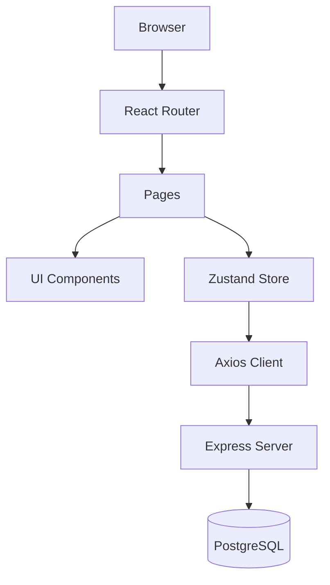

# Argon Design System - Modernization Prompt

## EXECUTIVE SUMMARY

Generate a complete **React 18 + TypeScript + Tailwind CSS** application that modernizes the legacy Vue.js Argon Design System.

**Scope**: 6 pages, 47 components, ~7,200 lines of code
**Output**: 59 files across frontend and backend

---

## ROLE & CONSTRAINTS

**Role**: You are a Senior Full-Stack Developer and Solutions Architect with 15+ years of experience building modern web applications. You specialize in:
- React 18 with TypeScript
- Tailwind CSS design systems
- Node.js/Express backends
- PostgreSQL databases
- JWT authentication patterns
- Cloud-native architectures


**CRITICAL RULES**:
- Generate ONLY React (.tsx/.ts) files — **NEVER .vue files**
- Use React 18 functional components with hooks
- Use TypeScript strict mode
- Use Tailwind CSS for ALL styling — NO SCSS, NO CSS modules
- Use Zustand for state management
- Use React Router 6 for navigation

---

## STEP 1: TARGET ARCHITECTURE

### 1.1 Architecture Pattern
**Modular Monolith** — React 18 frontend + Express API backend + PostgreSQL database

### 1.2 Module Boundaries

| Module | Responsibility |
|--------|----------------|
| **Auth** | Login, Register, Logout, JWT tokens |
| **UI** | 21 reusable Tailwind components |
| **Pages** | 6 application pages |
| **Layout** | Header, Footer, navigation |

### 1.3 Technology Stack

| Layer | Technology |
|-------|------------|
| Frontend | React 18 + TypeScript |
| State | Zustand |
| Routing | React Router 6 |
| Styling | Tailwind CSS |
| HTTP | Axios |
| Backend | Express + Node.js |
| Database | PostgreSQL |

### 1.4 API Endpoints

| Endpoint | Method | Purpose |
|----------|--------|---------|
| `/api/users/signup` | POST | Register user |
| `/api/users/login` | POST | Login user |
| `/api/auth/refresh` | POST | Refresh token |
| `/api/auth/logout` | POST | Logout user |

---

## STEP 2: ARCHITECTURE DIAGRAM



---

## STEP 3: FILE STRUCTURE

### Frontend (46 files)

```
src/
├── components/
│   ├── ui/           (21 files: Alert, Badge, Button, Card, Checkbox, etc.)
│   └── layout/       (4 files: Header, Footer, Layout, StarterHeader)
├── pages/            (6 files: Landing, Components, Login, Register, Profile, Starter)
├── pages/sections/   (15 files: Hero, BasicElements, Inputs, CustomControls, etc.)
├── stores/           (1 file: authStore.ts)
├── lib/              (2 files: api.ts, utils.ts)
└── routes.tsx
```

### Backend (8 files)

```
backend/src/
├── server.ts
├── config/database.ts
├── routes/auth.routes.ts
├── controllers/auth.controller.ts
├── services/auth.service.ts
├── repositories/user.repository.ts
├── models/user.model.ts
└── validators/auth.validator.ts
```

---

## STEP 4: MIGRATION WAVES

### Wave 1: Foundation (Week 1-2)
- [ ] Vite + React 18 + TypeScript scaffold
- [ ] Tailwind CSS with Argon theme colors
- [ ] React Router with 6 routes
- [ ] Axios API client
- [ ] Zustand auth store

### Wave 2: Authentication (Week 2-3)
- [ ] Login page with validation
- [ ] Register page with validation
- [ ] JWT token management
- [ ] Protected route guards
- [ ] Session persistence

### Wave 3: UI Components (Week 3-4)
- [ ] 21 UI components (Button, Alert, Modal, Tabs, etc.)
- [ ] 4 Layout components (Header, Footer)
- [ ] All 6 color variants for Navbar
- [ ] All 4 alert variants

### Wave 4: Pages & Polish (Week 4-5)
- [ ] Landing page with 10 sections
- [ ] Components showcase page
- [ ] Profile page
- [ ] Responsive design (320px - 1920px)
- [ ] Accessibility (WCAG 2.1 AA)

---

## STEP 5: UI COMPONENTS SPECIFICATION

### Color System

| Color | Hex | Usage |
|-------|-----|-------|
| Primary | #5e72e4 | Main actions |
| Success | #2dce89 | Confirmations |
| Danger | #f5365c | Errors |
| Warning | #fb6340 | Cautions |
| Info | #11cdef | Information |
| Default | #172b4d | Navigation |

### Component List (21 components)

| Component | Variants | Key Features |
|-----------|----------|--------------|
| Button | 6 colors, 3 sizes | Loading state, icons |
| Alert | 4 colors | Dismissible, icons |
| Badge | 5 colors | Pill shape |
| Card | - | Shadow, hover, image |
| Input | - | Icons, validation states |
| Checkbox | - | Custom styled |
| Radio | - | Group support |
| Switch | - | Toggle on/off |
| Modal | 3 types | Header, body, footer |
| Tabs | 2 styles | Icons, pills |
| Navbar | 6 colors | Responsive |
| Dropdown | - | Trigger, items |
| Pagination | - | Numbered, prev/next |
| Progress | - | Labeled, animated |
| Tooltip | 4 positions | Hover trigger |
| Slider | - | Range with labels |

---

## STEP 6: PAGE SPECIFICATIONS

### Landing Page (~800 lines)
1. Hero - gradient background, CTA buttons
2. Feature Cards - 3 cards with icons
3. Basic Elements - button examples
4. Inputs Section - form field examples
5. Custom Controls - checkboxes, radios, toggles
6. Navigation - 6 navbar variants
7. Javascript Components - tabs, modals, tooltips
8. Progress & Pagination
9. Icons Gallery
10. Download CTA
11. Contact Form

### Components Page (~600 lines)
- Showcase ALL UI components with interactive examples

### Login Page (~200 lines)
- Gradient background, social login buttons, form validation

### Register Page (~230 lines)
- Similar to login with name field and terms checkbox

### Profile Page (~100 lines)
- User avatar, stats, bio

---

## STEP 7: INFRASTRUCTURE

### Docker Compose Stack
- **Frontend**: Vite dev server on :5173
- **Backend**: Express server on :3000
- **Database**: PostgreSQL on :5432

### CI/CD Pipeline
1. Lint (ESLint)
2. Type Check (TypeScript)
3. Test (Vitest)
4. Build (Vite)
5. Deploy

---

## STEP 8: NON-FUNCTIONAL REQUIREMENTS

### Performance
- Page load: < 2 seconds
- Bundle size: < 150KB gzipped
- Lighthouse score: > 90

### Security
- httpOnly cookies for tokens
- CSRF protection
- Input validation with Zod

### Accessibility
- Keyboard navigation
- ARIA labels
- Color contrast ≥ 4.5:1

---

## STEP 9: DEPLOYMENT

### Local Development
```bash
# Start all services
docker-compose up

# Or manually
cd frontend && npm run dev
cd backend && npm run dev
```

### Production
- Frontend: Static files to CDN
- Backend: Container deployment
- Database: Managed PostgreSQL

---

## STEP 10: SUCCESS CRITERIA

### Functional
- [ ] All 6 pages render correctly
- [ ] All 21 UI components work
- [ ] Authentication flow complete
- [ ] Responsive on all devices

### Code Quality
- [ ] TypeScript strict mode (no `any`)
- [ ] ESLint errors: 0
- [ ] Test coverage: > 80%

### Output
- [ ] 59 files generated
- [ ] ~7,200 lines of code
- [ ] All components match Argon Design System

---

## DELIVERABLES CHECKLIST

### Frontend
- [ ] 21 UI components in `src/components/ui/`
- [ ] 4 layout components in `src/components/layout/`
- [ ] 6 pages in `src/pages/`
- [ ] 15 page sections in `src/pages/sections/`
- [ ] Auth store with Zustand
- [ ] API client with Axios
- [ ] Routes configuration

### Backend
- [ ] Express server
- [ ] Auth endpoints (signup, login, refresh, logout)
- [ ] PostgreSQL integration
- [ ] JWT token management

### Infrastructure
- [ ] docker-compose.yml
- [ ] Dockerfiles
- [ ] Environment configuration
- [ ] README with setup instructions

---

*Target: React 18 + TypeScript + Tailwind CSS*
*Output: ~7,200 lines across 59 files*
*Document Version: 2.0*
